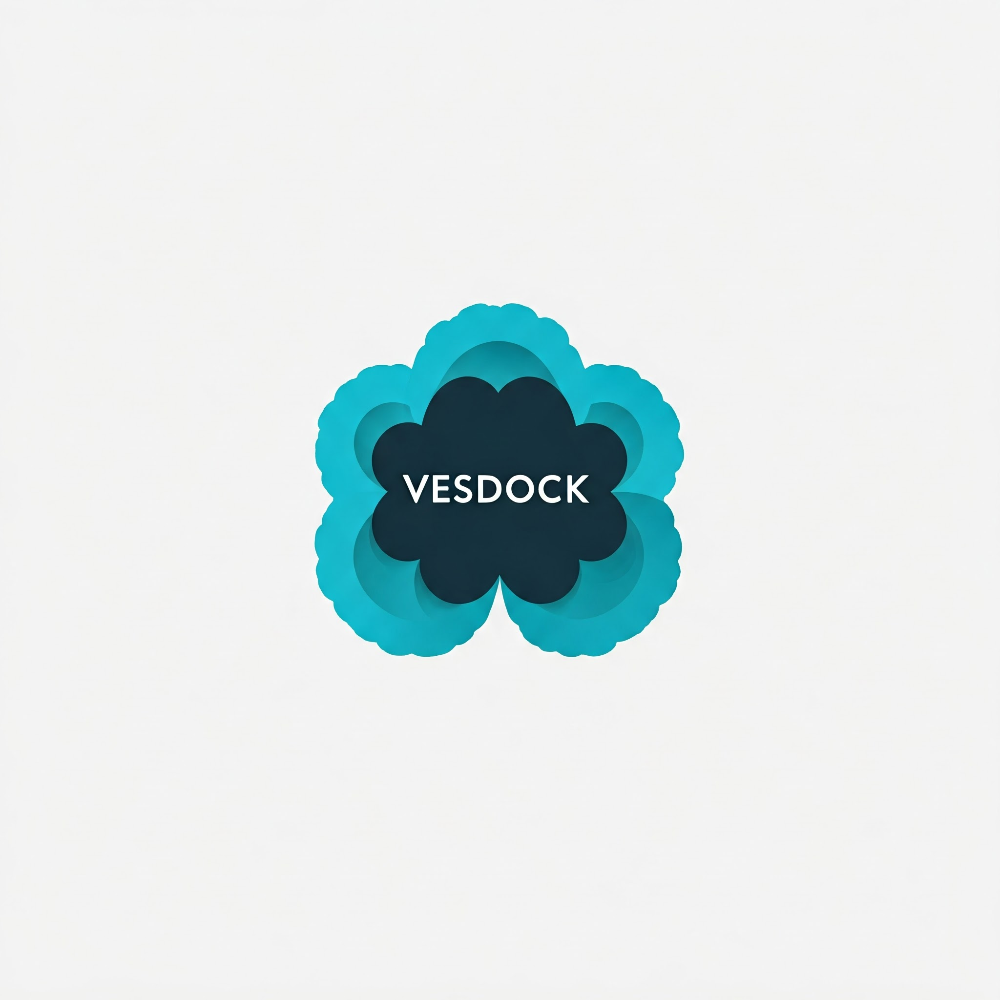
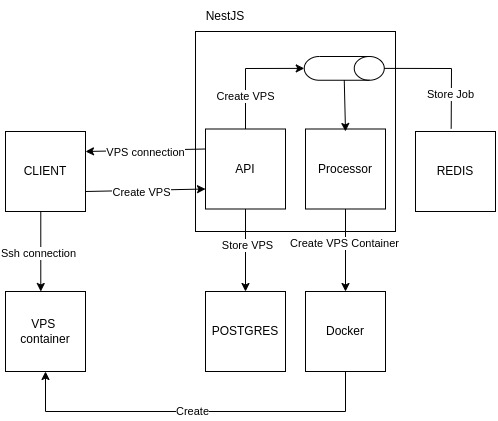

  

A powerful API built with NestJS and Docker to easily provision and manage VPS environments, such as Ubuntu and Debian.

## Technologies Used

  
An open platform for developing, shipping, and running applications, allowing you to manage containers with ease.

  
A powerful, open-source relational database known for its strong ACID compliance, extensibility, and support for advanced data types, making it ideal for complex queries and large-scale applications.

  
A JavaScript runtime built on Chrome's V8 JavaScript engine, designed for building scalable network applications.

  
A progressive Node.js framework for building efficient, reliable, and scalable server-side applications.

  
A multi-model database that brings together the capabilities of Redis with additional modules like Bloom filters, search, and graph processing.

  
A Node.js library for managing and processing job queues with Redis, designed for real-time and background processing.

## How It Works

  

1. **User requests to create VPS**:

   - NestJS receives the user's request, creates a VPS entry in PostgreSQL with the status "creating", and simultaneously pushes the information into a Queue (Bull and Redis) for the Processor to create the VPS.

2. **Server creates VPS**:

   - The Processor sends a request to Docker to create a new container (with the pre-configured image).
   - Once Docker creates the container, NestJS updates the VPS status to "running" and sends the connection details to the user.

3. **User connects to the VPS via SSH**:

   - The user uses the provided server connection details (SSH) to connect to their VPS.

## Demo

Check out the video demo of the project to see how it works in action:

<video width="900" controls>
  <source src="./videos/Screencast from 2024-12-15 15-28-52.webm" type="video/webm">
  Your browser does not support the video tag.
</video>

In this video, you can see the entire process of creating and connecting to a VPS using our service.

---
